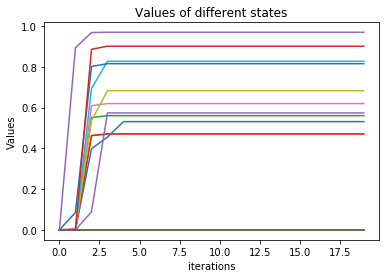

# Homework2 Report

## Value Iteration

For value iteration, we'll estimate a value  for every state, and our policy is simply to select the action which can transit the state to another state with largest expected value, .

After several iterations, we can observe that the action taken at each state can obtain a higher expected value.


## Policy Iteration

For policy iteration, we will need to compute the state-value function .

Differ from the value function, the **state-value function** returns sum of expected value of **all the possible next state** while value function only take the expected value of the next state which is brought by the optimal action into consideration.

In the implementation, the state-value function could be treated as simultaneous equations, and we use `np.linalg.solve` to obtain the exact solution for each state.

Once the state-value function is obtained, we further need the **state-action value function** to decide which action to take in a certain state. The state-action value function is defined as follow: , which returns a representation of expected reward for a pair of given state and action.

Then we can model our policy as , which directly uses Q-value to decide the action.

The rewards of several states increase faster than they do in value iteration.



## Sampling-based Tabular Q-Learning

Instead of using the transition function and the state-value function to compute the Q-function, we can also directly establish a table where each cell represents one or more states to model Q-function. The Q-value of every possible action at state s is stored in the cell of state s. Same as before, the policy is to select action at state s which can return the highest Q-value.

For the CrawlingRobotEnv(), the reward converges to 3.37 after 1e5 iterations.

```
Itr 0 # Average speed: 0.05
Itr 50000 # Average speed: 2.03
Itr 100000 # Average speed: 3.37
Itr 150000 # Average speed: 3.37
Itr 200000 # Average speed: 3.37
Itr 250000 # Average speed: 3.37
```