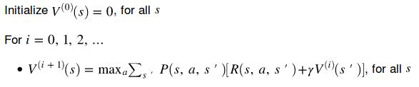
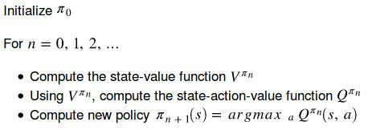
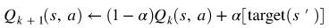

# Homework2 Report

### Value Iteration
&nbsp;&nbsp;&nbsp;&nbsp;&nbsp;&nbsp;For value iteration, we model all possible states which can be reached by the agent with as scalar-valued function called value function. We use bellman optimality equation to iteratively update and estimate value function. For each iteration, each value of all states will be no lower than that at previous iteration, shown as the follows,



Finally, the best value function is obtained and so is the best policy,


This is the implementation code.
```
V = Vprev.copy()
pi = np.zeros(mdp.nS)
for s in range(len(V)):
    for a in range(4):
        psr_arr = np.array(mdp.P[s][a])
        tmp_Vs = (psr_arr[:,0] * (psr_arr[:,2] + gamma*Vprev[psr_arr[:,1].astype(np.int16)])).sum(0)
        if tmp_Vs>V[s]: # assume there exists at least 1 tmp_Vs > V[s]
            V[s] = tmp_Vs
            pi[s] = a
```

### Policy Iteration
&nbsp;&nbsp;&nbsp;&nbsp;&nbsp;&nbsp;For policy iteration, instead of modeling only state value function, we further model state-action value function. All possible actions in a certain state are evaluated as a scalar value. By iteratively alternating between state value function and state-action value function, we can get the best state-action value function and simulatenously the best policy, shown as the following



This is the implementation code.
```
def compute_vpi(pi, mdp, gamma):
    a = np.eye(mdp.nS)
    b = np.zeros((mdp.nS,))
    for s in range(mdp.nS):
        act = pi[s]
        psr_tuple_list = mdp.P[s][act]
        for p, next_s, r in psr_tuple_list:
            a[s,next_s] -= gamma*p    
            b[s] += p*r
    V = np.linalg.solve(a, b)
    return V
    
def compute_qpi(vpi, mdp, gamma):
    Qpi = np.zeros([mdp.nS, mdp.nA])
    for s in range(mdp.nS):
        for a in range(4):
            psr_tuple_list = mdp.P[s][a]
            for p, next_s, r in psr_tuple_list:
                next_s = int(next_s)
                Qpi[s,a] += p * (r + gamma*vpi[next_s])
    return Qpi
    
# policy iteration
for itr in range(n_iters):
    # update state value function
    vpi = compute_vpi(pi_prev, mdp, gamma)
    # update state-action value function
    qpi = compute_qpi(vpi, mdp, gamma) 
  # the best action has highest score in state-action value function given a certain state
  pi = qpi.argmax(1) 
```

### Sampling-based Tabular Q-Learning
&nbsp;&nbsp;&nbsp;&nbsp;&nbsp;&nbsp;For sampling-based tabular Q-learning, we estimate state-action value function through sampling action and environmental response instead of using transition probability. Such technique refers to Q-learning in the following and it will converge to the best state-action value function as sampling step goes to infinity,



Also, to avoid the search space (while sampling) being confined to a certain region, we adopt epsilon-greedy policy in training, which allow the agent to take random action under a certain probability. This is the implementation code.
```
def q_learning_update(gamma, alpha, q_vals, cur_state, action, next_state, reward):
    target = reward + gamma*q_vals[next_state].max()
    q_vals[cur_state][action] = (1-alpha)*q_vals[cur_state][action] + alpha*target
    
def eps_greedy(q_vals, eps, state):
    import random
    if random.random() > eps: # random
        action = q_vals[state].argmax()
    else: # greedy
        action = random.randint(0,3)
    return action
    
# sampling-based tabular Q-learning
for itr in range(n_iters):
    # take action according to epsilon greedy policy
    action = eps_greedy(q_vals, eps, cur_state)
    # interact with the environment
    next_state, reward, done, info = env.step(action)
    # update state-action function using Q-learning
    q_learning_update(gamma, alpha, q_vals, cur_state, action, next_state, reward)
```

### Discussion
&nbsp;&nbsp;&nbsp;&nbsp;&nbsp;&nbsp;Policy iteration is kind of like an extension of value iteration and it has a more efficient update law. However, both policy iteration and value iteration require explicit knowledge of environment dynamics, i.e. transition probability, and this may be impracticle in real-world problem. Fortunately, Sampling-based Tabular Q-Learning can cope with such problem as it does not require explicit model of environment dynamics and obtain those information through sampling instead. The downside of sampling-based method is the nature of sampling, which brings data inefficiency while training an agent.
