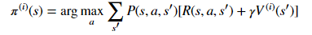
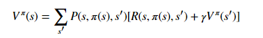
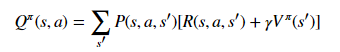
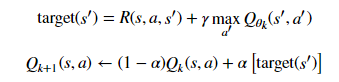

# Homework1 report

高穎 106062525

overview
  we will solve Markov Decision Processes (MDPs) with finite state and action spaces with several classic algorithms, which are value iteration, policy iteration, and tabular Q-learning. 
  
code 

Value Iteration

  
        V = np.zeros(mdp.nS) 
        pi = np.zeros(mdp.nS) 
        
        
        for state in range(mdp.nS):  #all states
            V_action = np.zeros(mdp.nA)  #all actions
            for action in range(mdp.nA):  #four
                 for num in range(len(mdp.P[state][action])):  
                    probability, next_state, reward = mdp.P[state][action][num]
                    V_action[action] += probability * (reward + gamma * Vprev[next_state])
                    
            V[state] = np.amax(V_action)   #update value funcion
            pi[state] = np.argmax(V_action)  #update policy
        

Policy Iteration
 1. compute_vpi that computes the state-value function for an arbitrary policy
 

                 
            a = np.eye(mdp.nS) #identity matrix
            b = np.zeros(mdp.nS) 
            V = np.zeros(mdp.nS) 

            for state in range(mdp.nS): #all states
                for num in range(len(mdp.P[state][pi[state]])):
                    probability, next_state, reward = mdp.P[state][pi[state]][num]
                    a[state][next_state] -= gamma * probability
                    b[state] += probability * reward
    
            
 2. compute_qpi that compute the state-action value function
 

  
         Qpi = np.zeros([mdp.nS, mdp.nA]) 
              for state in range(mdp.nS):
                  V_action = np.zeros(mdp.nA)
                  for action in range(mdp.nA):
                      for num in range(len(mdp.P[state][action])):
                          probability, next_state, reward = mdp.P[state][action][num]
                          Qpi[state][action] += probability * (reward + gamma * vpi[next_state])
  3.run the poolicy iteration that compute qpi which is the state-action values for current pi and compute the greedily policy, pi, from     qpi
    
          vpi = compute_vpi(pi_prev, mdp, gamma)
          Qpi = compute_qpi(vpi, mdp, gamma)
          pi = np.argmax(Qpi, axis=1)
    
Tabular Q-Learning
  
  1.eps_greedy that get random action with eps
  
    random_action=random.randrange(len(q_vals[state]))
    action = np.argmax(q_vals[state])
    if random.random() < eps:
         action = random_action
  
  2.q_learning_update that update the q_vals table to implement one step of Q-learning
  

    target = reward + gamma * np.max(q_vals[next_state])
    q_vals[cur_state][action] = ((1 - alpha) * q_vals[cur_state][action]) + (alpha * target)
    
  3.put everything together to create a complete q learning agent
  
    action = eps_greedy(q_vals, eps, cur_state)
    next_state, reward, done, info = env.step(action)
    q_learning_update(gamma, alpha, q_vals, cur_state, action, next_state, reward)
    cur_state = next_state
