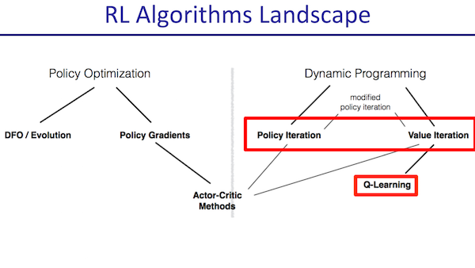
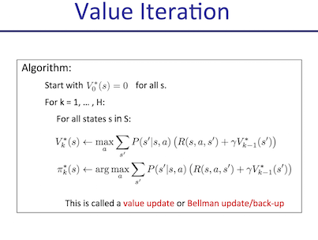
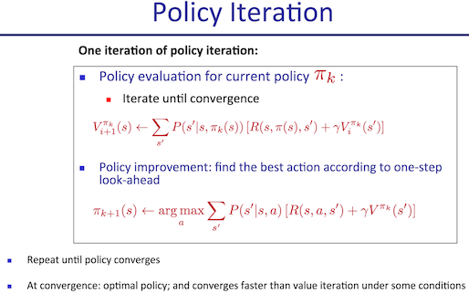
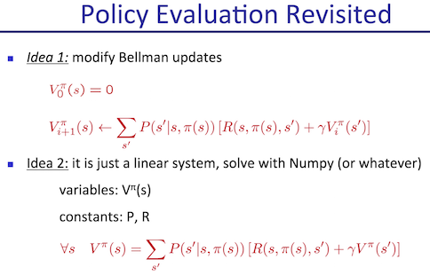
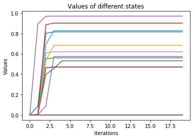
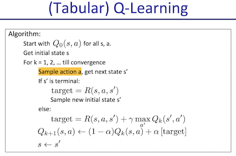
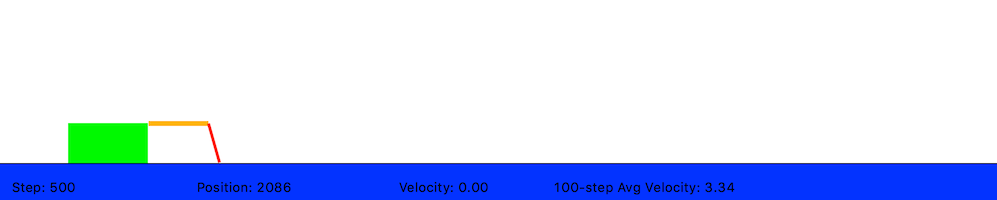

# Homework2 Report

In this homework, we are going to implement following RL algorithms as figure:



## Value Iteration




Code Snippet:
```python
v_s = []
pi_s = []
for s in range(mdp.nS):
    a2d = mdp.P[s]
    v_a = []
    for a in range(mdp.nA):
        v_a.append(sum([p * (r + gamma * Vprev[n_s]) for p, n_s, r in a2d[a]]))
    v_s.append(np.max(v_a))
    pi_s.append(np.argmax(v_a))
V = np.array(v_s)
pi = np.array(pi_s)
```

## Policy Iteration





> Here we have two ways for evaluating a policy: (1) Iteratively update V until it is convergent or (2) solve linear equation.



> Compared to value iteration, policy iteration has better performance as it takes fewer iterations to converge.

Code Snippet:
```python
def compute_vpi(pi, mdp, gamma):
    def idea1():
        """ Iteratively update V until it is convergent
        """
        V = np.zeros(mdp.nS)
        while True:
            Vprev = V.copy()
            for s in range(mdp.nS):
                V[s] = sum([p * (r + gamma * Vprev[n_s]) for p, n_s, r in mdp.P[s][pi[s]]])
            if np.array_equal(V, Vprev):
                break
        return V

    def idea2():
        """ Solve linear equation
        """
        a = np.zeros((mdp.nS, mdp.nS))
        b = np.zeros(mdp.nS)
        V = np.zeros(mdp.nS)
        I = np.identity(mdp.nS)
        P = np.zeros((mdp.nS, mdp.nS))

        for s in range(mdp.nS):
            for p, n_s, r in mdp.P[s][pi[s]]:
                # Notice:
                # Next state not only corresponding to single probability,
                # so we have to accumulate probability of all the same next state.
                # e.g. see mdp.P[3][3] = [(0.1, 3, 0.0), (0.8, 3, 0.0), (0.1, 2, 0.0)]
                P[s][n_s] += p
                b[s] += p * r

        a = I - gamma * P
        V = np.linalg.solve(a, b)
        return V

#     V = idea1()
    V = idea2()

    return V
```

## Sampling-based Tabular Q-Learning

Both value iteration and policy iteration require agent know about the MDP model (so that it can select the max reward from all possible next state).
How if the state transition and reward are unknown until the agent actually interact with?
We can use sampling-based Q-Learning which is a model-free (v.s model-base) learning.





Code Snippet:
```python
def eps_greedy(q_vals, eps, state):
    import random
    action = np.argmax(q_vals[state]) if random.random() < (1 - eps) else np.random.choice(len(q_vals[state]))
    return action

def q_learning_update(gamma, alpha, q_vals, cur_state, action, next_state, reward):
    target = reward + gamma * np.max(q_vals[next_state])
    q_vals[cur_state][action] = (1 - alpha) * q_vals[cur_state][action] + alpha * target

for itr in range(300000):
    action = eps_greedy(q_vals, eps, cur_state)
    next_state, reward, done, info = env.step(action)
    q_learning_update(gamma, alpha, q_vals, cur_state, action, next_state, reward)
    cur_state = next_state
```