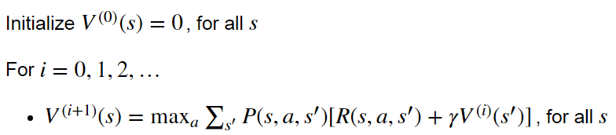
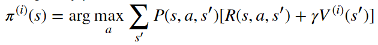
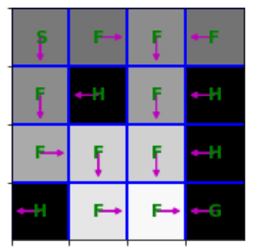

# 王智寬 (106062601)

# Homework2 / MDPs

## Overview
In homework2, we solve Markov Decision Processes(MDPs) with finte state and action space via value iteration, policy iteration, and tabular Q-learning. 

In first and second part, we use the <code>FrozenLakeEnv()</code> environment, a simple gridworld MDP that is taken from gym library, to implement value iteration and policy iteration. 

In the last part, we utilize <code>CrawlingRobotEnv()</code> , a crawler robot which is also taken from gy,, to implement tabular Q-learning.

## Part 1 : implement value iteration

### Algorithm

### Code

I complete <code>value_iteration() </code> to implement the value iteration. In each iteration, here are some highlights :

Initalize an iteration by

<code>

  Vprev = Vs[-1] # V^{(it)}

  V = np.zeros(nS)

  pi = np.zeros(nS)

</code>

I use 3 for-loops to calculate value and get optimal pi:

  first loop: find all states s0~s15's Value and action

  second loop: find a state's best value and action

  third loop : find all possible move in a direction

Then I use <code>np.amax()</code> to get Value, <code>np.argmax()</code> to get pi

<code>

    for state in range(nS):          
        
        V_dir = np.zeros(4)
        
        for direct in range(4):        
            
            for possible_dir in range(len(mdp.P[state][direct])):
            
                reward = gamma*Vprev[mdp.P[state][direct][possible_dir][1]]
                
                V_dir[direct] = V_dir[direct] + mdp.P[state][direct][possible_dir][0]* (mdp.P[state][direct][possible_dir][2] + reward)
        
        V[state]=np.amax(V_dir)
        
        pi[state]=np.argmax(V_dir)

</code>

### Results

## Part 2 : 

## Part 3 :

