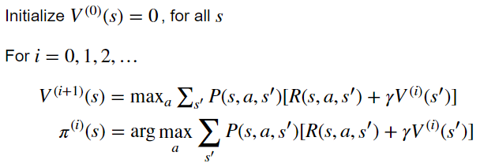
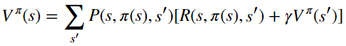
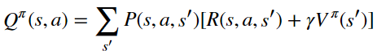
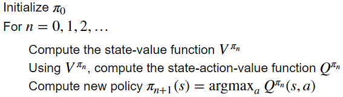
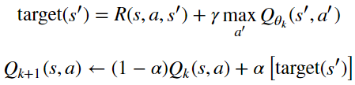

# Homework2 report

TA: try to elaborate the algorithms that you implemented and any details worth mentioned.

## Value Iteration



> For each iteration, update value functions and policies for all states.

```
V = np.zeros(mdp.nS) # value function
pi = np.zeros(mdp.nS) # policy
for s in range(mdp.nS): # [0, 1, 2, ..., 15] from left to right and top to down
	V_a = np.zeros(mdp.nA) # for all actions
	for a in range(mdp.nA): # West, South, East and North
		for P, next_state, R in mdp.P[s][a]: # (probability, nextstate, reward)
			V_a[a] += P * (R + gamma * Vprev[next_state]) # sum for all next states
	V[s] = np.amax(V_a)
	pi[s] = np.argmax(V_a)
```


## Policy Iteration

* compute_vpi



> Compute state value functions for arbitrary policies.

> Find an exact solution with `np.linalg.solve`.

```
a = np.zeros((mdp.nS, mdp.nS))
b = np.zeros(mdp.nS)
V = np.zeros(mdp.nS)
for s in range(mdp.nS): # [0, 1, 2, ..., 15] from left to right and top to down
	a[s][s] = 1 # a is identity matrix, diagonal = 1
	for P, next_state, R in mdp.P[s][pi[s]]: # (probability, nextstate, reward), for an arbitrary policy pi
		a[s][next_state] -= gamma * P
		b[s] += P * R
V = np.linalg.solve(a, b) # aV = b
```

* compute_qpi



> Compute state-action value functions for all states and actions.

```
Qpi = np.zeros([mdp.nS, mdp.nA])
for s in range(mdp.nS): # [0, 1, 2, ..., 15] from left to right and top to down
	for a in range(mdp.nA): # West, South, East and North
		for P, next_state, R in mdp.P[s][a]: # (probability, nextstate, reward)
			Qpi[s][a] += P * (R + gamma * vpi[next_state]) # vpi: state value function
```

* policy_iteration



> For each iteration, compute policy evaluation for current policy,

> then improve policies (find the best acLon according to one-step look-ahead).

```
vpi = compute_vpi(pi_prev, mdp, gamma)
Qpi = compute_qpi(vpi, mdp, gamma)
pi = np.argmax(Qpi, axis=1)
```


## Sampling-based Tabular Q-Learning

* eps_greedy

> Sample random action with probability of eps;

> or best action argmax Q(s, .) with probability of (1-eps) for current state.

```
action = random.randrange(len(q_vals[state])) if random.random() < eps else np.argmax(q_vals[state])
```

* q_learning_update



> Incorporate the new estimate into a running average.

```
target_next_state = reward + gamma * np.max(q_vals[next_state])
q_vals[cur_state][action] = (1-alpha) * q_vals[cur_state][action] + alpha * target_next_state
```

* create Q learning agent

> For each iteration, sample random action, get next state,

> then perform in-place update of Q values.

```
action = int(eps_greedy(q_vals, eps, cur_state))
next_state, reward, done, info = env.step(action)
q_learning_update(gamma, alpha, q_vals, cur_state, action, next_state, reward)
cur_state = next_state
```
