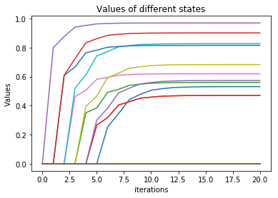
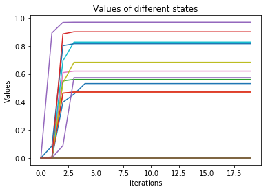
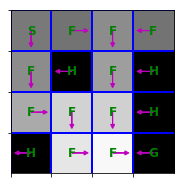

# Homework1 report
In this lab, I implement some parts of value iteration, policy iteratioin and tabular Q-learning. Following is what I think worth mentioned.

1. In problem 1, I use three loops to update the value function. The first two loops are for actions and states, the last loop is to iterate the list of next states possibility tuple. In problem 2 policy iteration, evaluation of the state function only requires two loops. Therefore, for problems have large action space, state function might be a good choice for speech consideration.

2. For this problem setting, as shown below, policy iteration converges faster than value iteration. I'm not sure if this holds for other problems. Figure in the left is for value iteration, figure in the right is for policy iteration.
 

3. The reward of each state and optimal policy for value iteration could be visualized as following.

