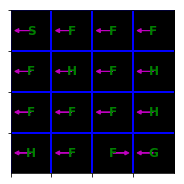
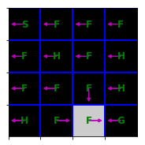
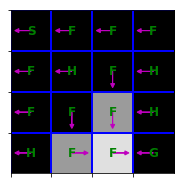
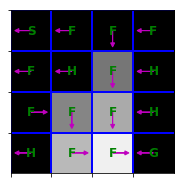
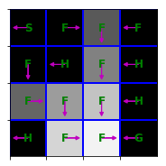
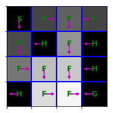
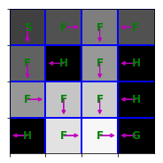
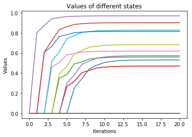
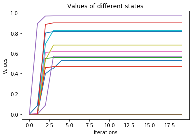

# Homework2 report

陳則銘 105062576

## Introduction
In this lab, we will solve **Markov Decision Processes (MDPs) with finite state and action spaces** with several classic algorithms that you learnt in the class.

The experiments here will use the Frozen Lake environment, a simple gridworld MDP that is taken from `gym` and slightly modified for this assignment. In this MDP, the agent must navigate from the start state to the goal state on a 4x4 grid, with stochastic transitions.

## Problem 1: implement value iteration

The pseudocode we need to implement:
> Initialize <a href="https://www.codecogs.com/eqnedit.php?latex=V^{(0)}(s)=0" target="_blank"></a>, for all <a href="https://www.codecogs.com/eqnedit.php?latex=s" target="_blank"></a>
> - For <a href="https://www.codecogs.com/eqnedit.php?latex=i&space;=&space;0,1,2,..." target="_blank"></a>
<a href="https://www.codecogs.com/eqnedit.php?latex=V^{(i&plus;1)}(s)=max_a\sum_{s'}P(s,a,s')[R(s,a,s')&plus;\gamma&space;V^{(i)}(s')]" target="_blank"></a>, for all <a href="https://www.codecogs.com/eqnedit.php?latex=s" target="_blank"></a>
---------
We additionally define the sequence of greedy policies:
> <a href="https://www.codecogs.com/eqnedit.php?latex=\pi&space;^{(i)}(s)=argmax_a\sum_{s'}P(s,a,s')[R(s,a,s')&plus;\gamma&space;V^{(i)}(s')]" target="_blank"></a>

Our code will return two lists:<a href="https://www.codecogs.com/eqnedit.php?latex=[V^{(0)},V^{(1)},...,V^{(n)}]" target="_blank"></a> and <a href="https://www.codecogs.com/eqnedit.php?latex=[\pi^{(0)},\pi^{(1)},...,\pi^{(n-1)}]" target="_blank"></a>

```
for it in range(nIt):
    oldpi = pis[-1] if len(pis) > 0 else None 
    Vprev = Vs[-1]
    V = []
    pi = []
    for sta in range(mdp.nS):
        maxv = 0
        maxpi = 0
        for act in range(mdp.nA):
            v = 0
            for n in mdp.P[sta][act]:
                v = v + n[0]*( n[2] + gamma*Vprev[n[1]] )
            if (maxv < v):
                maxv = v
                maxpi = act

        V = np.append(V, maxv)
        pi = np.append(pi, maxpi)
     Vs.append(V)
     pis.append(pi)
```










## Problem 2: Policy Iteration

This task is to implement exact policy iteration(PI), the psuedocode below:
> Initialize <a href="https://www.codecogs.com/eqnedit.php?latex=\pi_0" target="_blank"></a>
> For <a href="https://www.codecogs.com/eqnedit.php?latex=i&space;=&space;0,1,2,..." target="_blank"></a>
> - Compute the state-value function <a href="https://www.codecogs.com/eqnedit.php?latex=V&space;^{\pi}(s)=\sum_{s'}P(s,\pi(s),s')[R(s,\pi(s),s')&plus;\gamma&space;V^{\pi}(s')]" target="_blank"></a>
> - Using <a href="https://www.codecogs.com/eqnedit.php?latex=V&space;^{\pi}(s)" target="_blank"></a> , compute the state-action-value function <a href="https://www.codecogs.com/eqnedit.php?latex=Q&space;^{\pi}(s,a)=\sum_{s'}P(s,a,s')[R(s,a,s')&plus;\gamma&space;V^{\pi}(s')]" target="_blank"></a>
> - Compute new policy <a href="https://www.codecogs.com/eqnedit.php?latex=\pi_{n&plus;1}(s)=argmax_a&space;Q^{\pi_n}(s,a)" target="_blank"></a>

```
1. state value function:
def compute_vpi(pi, mdp, gamma):
    a = np.identity(mdp.nS) 
    b = np.zeros(mdp.nS)  
    for sta in range(mdp.nS):
        v = mdp.P[sta][pi[sta]]
        for n in v:
            a[sta][n[1]] = a[sta][n[1]] - gamma*n[0]
            b[sta] += n[0]*n[2]
            
    V = np.linalg.solve(a, b)
    return V
```

```
2. state-action value funtion:
def compute_qpi(vpi, mdp, gamma):
    Qpi = np.zeros([mdp.nS, mdp.nA]) 
    for sta in range(mdp.nS):
        for act in range(mdp.nA):    
            for n in mdp.P[sta][act]:
                Qpi[sta][act] += n[0] * ( n[2] + vpi[n[1]]*gamma ) 
      
    return Qpi
```

```
3. Policy iteration:
def policy_iteration(mdp, gamma, nIt, grade_print=print):
    Vs = []
    pis = []
    pi_prev = np.zeros(mdp.nS,dtype='int')
    pis.append(pi_prev)
    for it in range(nIt):      
        vpi = compute_vpi(pis[-1], mdp, gamma)
        qpi = compute_qpi(vpi, mdp, gamma)       
        pi = np.argmax(qpi,axis=1)

        Vs.append(vpi)
        pis.append(pi)
        pi_prev = pi
    return Vs, pis
```

## Problem 3: Sampling-based Tabular Q-Learning

So far we have implemented Value Iteration and Policy Iteration, both of which require access to an MDP's dynamics model. This requirement can sometimes be restrictive - for example, if the environment is given as a blackbox physics simulator, then we won't be able to read off the whole transition model.
We can however use sampling-based Q-Learning to learn from this type of environments.
For this exercise, we will learn to control a Crawler robot. Let's first try some completely random actions to see how the robot moves and familiarize ourselves with Gym environment interface again.

By randomly choose the action, we will see the controller can sometimes make progress but it won't get very far. So we implement Tabular Q-Learning with ϵ-greedy exploration to find a better policy piece by piece.

```
def eps_greedy(q_vals, eps, state):
    import random
    _eps = random.random()
    if _eps <= eps:
            action = random.randint(0,3)
    else:
        action = np.argmax(q_vals[state])

    return action
```

Next we will implement Q learning update. After we observe a transition <a href="https://www.codecogs.com/eqnedit.php?latex=s,a,s',r" target="_blank"></a>

> <a href="https://www.codecogs.com/eqnedit.php?latex=target(s')=R(s,a,s')&plus;\gamma&space;max_{a'}Q_{\theta&space;_k}(s',a')" target="_blank"></a>
> <a href="https://www.codecogs.com/eqnedit.php?latex=Q_{k&plus;1}(s,a)&space;\leftarrow&space;(1-\alpha&space;)Q_k(s,a)&plus;\alpha[target(s')]" target="_blank"></a>

```
def q_learning_update(gamma, alpha, q_vals, cur_state, action, next_state, reward):   
    targets = reward + gamma * np.max(q_vals[next_state])
    q_vals[cur_state][action] = (1-alpha)*q_vals[cur_state][action]+alpha*targets
```

Now create a complete q learning agent
```
for itr in range(300000):
    action = eps_greedy(q_vals, eps, cur_state)
    next_state, reward, done, info = env.step(action)
    q_learning_update(gamma, alpha, q_vals, cur_state, action, next_state, reward)
    cur_state = next_state
```

Note that in this task, the average speed should be around 3.37, and our results is:
> Itr 0 # Average speed: 0.05

> Itr 50000 # Average speed: 2.03

> Itr 100000 # Average speed: 3.37

> Itr 150000 # Average speed: 3.37

> Itr 200000 # Average speed: 3.37

> Itr 250000 # Average speed: 3.37


After the learning is successful, we can visualize the learned robot controller. Remember we learn this just from interacting with the environment instead of peeking into the dynamics model!


## Discustion

In problem1: value iteration, the values become stable when the first changed value close to 1.0, and the converge iteration cost also decrease.
> 

In problem2: Policy iteration, the values will not become stable when the first values changed a lot, it seems have nothing relativity. But all of the values will converge before 5 iterations.
> 

In problem3: Sampling-based Tabular Q-Learning, we solved the exact state values (V) or state-action values (Q) with the transition function and reward function. However, in most cases, having transition function and reward function is a really strong assumption.


So, in the next work, we will assume that both transition function and reward function are unknown and use the agent's experiences (trial and error) to figure out how to maximize the accumulated reward.
