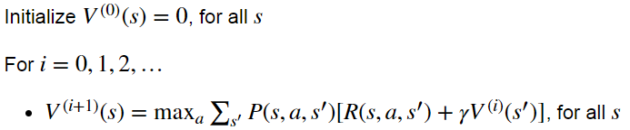
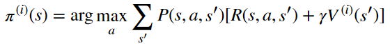
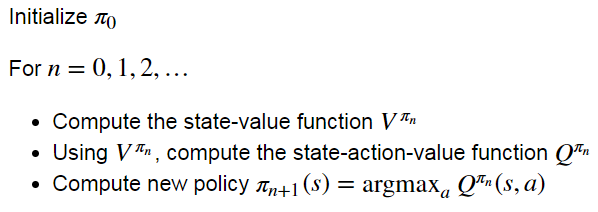
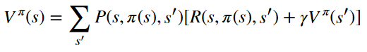
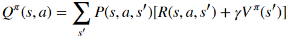
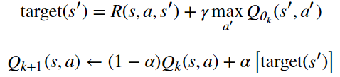

# Homework2 / MDPs

## Overview
This homework is related to 
> solve <b>Markov Decision Processes (MDPs) with finite state and action spaces</b> with <b>Value Iteration</b>, <b>Policy Iteration</b> and <b>Sampling-based Tabular Q-Learning</b>. 

In the homework, we implement the three classic algorithms in two environments: 
* For <b>Frozen Lake</b>, we use <b>Value Iteration</b> and <b>Policy Iteration</b>. 
* For <b>a Crawler robot</b>, we use <b>Sampling-based Tabular Q-Learning</b>.

Both environments are taken from `gym`.

## Frozen Lake Environment
### Problem1: Implement Value Iteration
* Pseudocode:
	for Value:
	<p align="center"></p>
	for Policy:
	<p align="center"></p>
* Code
	Intialize `V` and `pi`.
	```
	V = np.zeros(mdp.nS)
	pi = np.zeros(mdp.nS)
	```
	
	For all the state `s`, follow the steps below:
	* 1. Sum up the dicounted reward for one action.		
	```
	for prob, nxt_sta, reward in mdp.P[s][a]:
		action[a] += prob * (reward + gamma * Vprev[nxt_sta])
	```
	* 2. Select the maximum rewards to the value `V`.
	```
	V[s] = action.max()
	```
	* 3. Argmax the rewards to the policy `pi`.
	```
	pi[s] = np.argmax(action)
	```
	
	Finally, Repeat iterate all the states.
		
### Problem2: Implement Policy Iteration
The implemention of Policy Iteration is divided into three parts. One for state value function, another one for state-action value function and the other one for policy iteration, which combines state value function and state-action value function. 
* Pseudocode:
	For all:
	<p align="center"></p>
	For state value:
	<p align="center"></p>
	For state-action value:
	<p align="center"></p>

* Code:
	<b>Part 1: state value function</b> (`compute_vpi`)
	* To be notice, we're using `np.linalg.solve` to calculate the value `V`.
	* Follow the guide bellow.
	```
	# V[s] = P*(R + \gamma*V[s'])
	# => (I-\gamma*P)*V = P*R
	# solve linear matrix
	# (I-\gamma*P): (nS, nS) => a
	# P*R => b
	```
		1. Intialize `a` and `b`.
		```
		a = np.eye(mdp.nS)
		b = np.zeros(mdp.nS)
		```
		2. For all the state `s`, we calculate `a` and `b` in the way that the guide shows.
		```
		for prob, nxt_sta, reward in mdp.P[s][pi[s]]:            
			a[s][nxt_sta] -= gamma * prob
			b[s] += prob * reward
		```
		3. Calculate the value `V` with `np.linalg.solve`.
		```
		V = np.linalg.solve(a, b)
		```
		
	<b>Part 2: state-action value function</b> (`compute_qpi`)
	* Intialize `Qpi`.
	```
	Qpi = np.zeros([mdp.nS, mdp.nA])
	```
	* For all the state `s`, we sum up the dicounted reward for a action.
	```
	for a in range(mdp.nA):
		for prob, nxt_sta, reward in mdp.P[s][a]:
			Qpi[s][a] += prob * (reward + gamma * vpi[nxt_sta])
	```
	
	<b>Part 3: policy iteration</b> (`policy_iteration`)
	* Combine part 1 and 2.
	* In order to get the policy `pi`, we need to argmax `qpi`. Before we get `qpi` from `compute_qpi`, the parameter `vpi` should be calculated first. So we use `compute_vpi` to output the value `vpi`. 
	```
	vpi = compute_vpi(pi_prev, mdp, gamma)
	qpi = compute_qpi(vpi, mdp, gamma)
	pi = np.argmax(qpi, axis = 1)
	```
	* Finally, iterate the policy.
		
## a Crawler robot Environment

### Problem3: Implement Sampling-based Tabular Q-Learning
The implemention of Sampling-based Tabular Q-Learning is also divided into three parts. One for `eps_greedy`, another one for `q_learning_update` and the other one for the main part, which combines `eps_greedy` and `q_learning_update`.

* Code
	1. `eps_greedy`:
	Follow the guide below.
	```
	"""
	Inputs:
		q_vals: q value tables
		eps: epsilon
		state: current state
	Outputs:
		random action with probability of eps; argmax Q(s, .) with probability of (1-eps)
	"""
	# you might want to use random.random() to implement random exploration
	#   number of actions can be read off from len(q_vals[state])
	```
		* Import `random`
		* Random exploration. If random.random() > eps, argmax `q_vals`. Otherwise, random action.
		```
		if random.random() > eps:
			action = np.argmax(q_vals[state])
		else:
			action = random.randint(0, len(q_vals[state])-1)
		```
	2. `q_learning_update`:
		* Pseudocode:
		<p align="center"></p>
		* Code:
		Calculate the dicounted reward to the target `target`.
		```
		target = reward + gamma * np.max(q_vals[next_state])
		```
		Update the dicounted reward with learning rate `alpha` in Q table.
		```
		q_vals[cur_state][action] = (1 - alpha) * q_vals[cur_state][action] + alpha * target
		```
	3. The main part:
		Combine `eps_greedy` and `q_learning_update`.
		* Find the action.
		```
		action = eps_greedy(q_vals, eps, cur_state)
		```
		* Get `next_state` and `reward` with the action `action` calculated by `eps_greedy`.			
		```			
		next_state, reward, done, info = env.step(action)  
		```
		* Updating Q-value by `q_learning_update`.
		```
		q_learning_update(gamma, alpha, q_vals, cur_state, action, next_state, reward)
		```
		* Finally, iterate the steps above.