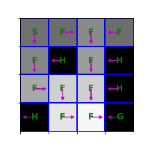

# Homework2 report (105061523)

In this homework, we will solve Markov Decision Processes (MDPs) with finite state and action spaces with several classic algorithms that you learnt in the class.

## Problem 1: implement value iteration
### Methodology
Value iteration is a method of computing an optimal MDP policy and its value. Value iteration starts at the "end" and then works backward, refining an estimate of either Q or V. There is really no end, so it uses an arbitrary end point. Let Vk be the value function assuming there are k stages to go, and let Qk be the Q-function assuming there are k stages to go. These can be defined recursively.

### Pseudo Code
Initialize , for all 

For 
- , for all 

### Result
<table border=1>
<tr>
	<td>
	
	
	
	
	
	</td>
</tr>
<tr>
	<td>
	
	
	
	
	
	</td>
</tr>
</table>
 

## Problem 2: Policy Iteration

### Methodology
* Step a
	

	Use function `compute_vpi` that computes the state-value function  for an arbitrary policy .
	Recall that  satisfies the following linear equation:
	
	

* Step b
	

	Write a function to compute the state-action value function , defined as follows 
	

### Pseudo Code
Initialize   

For 
- Compute the state-value function 
- Using , compute the state-action-value function 
- Compute new policy 

### Result

## Problem 3: Sampling-based Tabular Q-Learning

### Pseudo Code
Q learning update. After we observe a transition ,  
  

### Result

