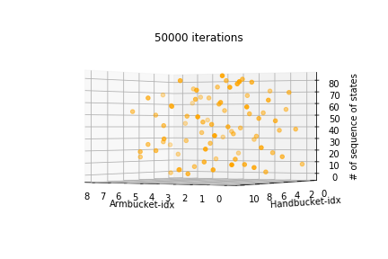
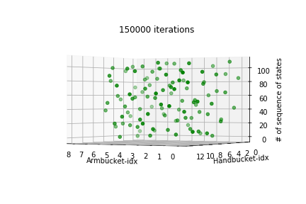
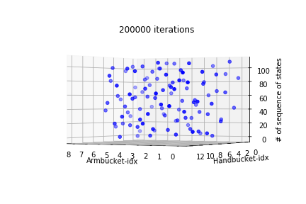
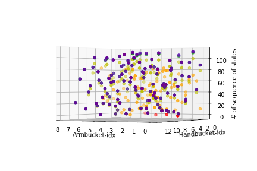

# 106061532洪彗庭 CEDL-hw2

In this assignment we have implemented value and policy iteration on MDP's dynamics model and also use sampling-based Q-Learning to learn to control a Crawler robot.

## Setup
Simply follow the instructions from TA, like follows:

```
conda env create -f environment.yml
source activate cedl
# deactivate when you want to leave the environment
source deactivate cedl
```

## Simple Gridworld - Frozen Lake environment
The environment looks like follows as described from gym: </br>

```   	 
        SFFF
        FHFH
        FFFH
        HFFG

    S : starting point, safe
    F : frozen surface, safe
    H : hole, fall to your doom
    G : goal, where the frisbee is located
```

The MDP of this problem is specified as follows:

- _States(S)_:

```
        SFFF			0  1  2  3 
        FHFH			4  5  6  7
        FFFH     -> 		8  9  10 11
        HFFG			12 13 14 15
```

- _Gamma(γ)_: 0.95 </br>
- _Actions(A)_:

```
0 : Left
1 : Down
2 : Right
3 : Top
```

- _Transition-of-states (P), Rewards (R)_:

```
========== in state 0 ==========
state 0, action 0, (prob, next-s, rw) = (0.1, 0, 0.0)
state 0, action 0, (prob, next-s, rw) = (0.8, 0, 0.0)
state 0, action 0, (prob, next-s, rw) = (0.1, 4, 0.0)
state 0, action 1, (prob, next-s, rw) = (0.1, 0, 0.0)
state 0, action 1, (prob, next-s, rw) = (0.8, 4, 0.0)
state 0, action 1, (prob, next-s, rw) = (0.1, 1, 0.0)
state 0, action 2, (prob, next-s, rw) = (0.1, 4, 0.0)
state 0, action 2, (prob, next-s, rw) = (0.8, 1, 0.0)
state 0, action 2, (prob, next-s, rw) = (0.1, 0, 0.0)
state 0, action 3, (prob, next-s, rw) = (0.1, 1, 0.0)
state 0, action 3, (prob, next-s, rw) = (0.8, 0, 0.0)
state 0, action 3, (prob, next-s, rw) = (0.1, 0, 0.0)
...
...
...
========== in state 15 ==========
state 15, action 0, (prob, next-s, rw) = (1.0, 15, 0)
state 15, action 1, (prob, next-s, rw) = (1.0, 15, 0)
state 15, action 2, (prob, next-s, rw) = (1.0, 15, 0)
state 15, action 3, (prob, next-s, rw) = (1.0, 15, 0)
```

here it saves all these information in a 2-level dictionary, **mdp.P**, to represent the states, possible actions in each state, and their rewards.
</br>

### Value iteration

The concept in value iteration is base on **Bellman Optimization Equation**: </br></br>

</br></br>
which in this case, since rewards also relate to s', we can rewrite it as:</br></br>


the idea is that for each iteration, we will find max value returned from all possible actions on current state, and replace the old value function of current state, s, with the new value functin. However in the implementation, we don't actually replace it directly, since we need to calculate the amount of difference of value function between current iteration and previous iteration. The result is as follows:
<p align="center"></p>

For finding the best policy, we actually only need to take _argmax_ once after the whole iterations are done, since at that time, our value function has already converged to the certain stage. However, in this assignment, since we are going to see the number of changed actions in each iteration, we will extract current policy every iteration. As the result shown below, we can see there are few actions changes when iteration goes higher.
<p align="center"></p>

The final optimal policy output can be seen in the [Lab2-MDPs.ipynb](./Lab2-MDPs.ipynb)
</br>

### Policy iteration
The concept in policy iteration is base on **Bellman Expectation Equation** and **greedy selection of v_pi**, the Bellman Expectation Equation of v_pi  is as follows: </br></br>


However in this environment, our policy is deterministic policy, which means that we can simply rewrite the function as : </br></br>


The key idea of policy iteration is that it will **first evaluate the given policy** and then **improve the policy**. In the evaluating stage, we solve the value function in a _batch-learning_ way, instead of _online-learning_ way, which means that we didn't apply multiple iterations in order to solve the best value function base on certain policy, instead, we just come out a close form solution for our best value function. </br>
After solving the state value function we can then move on to solve the action-state value function to help us find the best policy. For every iteration, we update policy once, and in the next iteration, we will evaluate our policy again, and so on and so forth. </br>
As the same result in value iteration, we can see the number of changed actions goes to zero when iterations go higher. (The equation of _action-state value function_ and the equation of _policy_ are all described clear in the [Lab2-MDPs.ipynb](./Lab2-MDPs.ipynb), I will simply skip here)
<p align="center"></p>

The final optimal policy output can also be seen in the [Lab2-MDPs.ipynb](./Lab2-MDPs.ipynb)

### Why Policy-iteration converge faster than value-iteration
<div align="center">


</div>

On the left hand side is the state-value-function result of **Policy Iteration** and **Value Iteration** on the right hand side. We can see in less number of iterations, the policy iteration achieves stable level. </br></br>

* reason:

The main reason is that in one iteration, the Value-Iteration approach will only update value function once(on selecting the maximum result from all possible actions), while the Policy-Iteration approach will update the value function multiple times on given a certain policy, which is the **evaluating policy** stage we described in the _Policy Iteration_ above. (we solve in a close form solution way, so it's not obvious to see directly from the code). Therefore, we could expect that, in one iteration, the Policy-Iteration approach will update value function to a better stage compare with the result from Value-Iteration approach only because it updates much more times. </br>

* pros and cons:

Although Policy-Iteration converges faster, as we described above, it will be pretty expensive on **evaluating the policy**, but if it could evaluate the policy really fast like in this MDP problem, then Policy-Iteration is definitely a better choice for solving the problem.
</br>

## Crawler robot

In this problem, we define our crawler as follows: </br>

- _States(S)_:

```
state = (ArmBucket_index, HandBucket_index)
ArmBucket_index = 0 ~ 8
HandBucket_index = 0 ~ 12
which ArmBucket = [-0.5235987755982988, -0.39269908169872414, -0.2617993877991494, -0.13089969389957468, 0.0, 0.13089969389957468, 0.26179938779914946, 0.39269908169872414, 0.5235987755982988]
HandBucket = [-2.6179938779914944, -2.399827721492203, -2.181661564992912, -1.9634954084936207, -1.7453292519943298, -1.5271630954950384, -1.3089969389957472, -1.090830782496456, -0.8726646259971649, -0.6544984694978737, -0.43633231299858233, -0.21816615649929139, 0.0]
```

- _Actions(A)_:

```
0: ArmBucket_index-1 (decrease the angle of Arm)
1: ArmBucket_index+1 (increase the angle of Arm)
2: HandBucket_index-1 (decrease the angle of Hand)
3: HandBucket_index+1 (increase the angle of Hand)
```

- _Gamma(γ)_: 0.9 </br>
- _Rewards(R)_: the x-distance of moving </br>
- _alpha(learning rate, α)_: 0.1 </br>
- _epsilon(greedy exploration probability, ϵ)_: 0.5 </br>


### Sampling-based Tabular Q-Learning
In this approach, we mainly follow these two equations: </br></br>

</br></br>
where the _a_ would have ϵ probability to be random selected.</br></br>
For each iteration, we will first sample an action(0.5 for random, 0.5 for extracting maximum q-value index for certain state), and then apply update on our q-value base on the above two equations. We can see the state changes as below :</br>
<div align="center">


</div>
<div align="center">


</div>
<div align="center">


</div>

which the x-axis represents the armbucket-index, y-axis represents the handbucket-index, and the z-axis represents the sequence of the states. If we draw them all in the same figure, we could see:</br>
<p align='center'></p>

which the iteration from low to high corresponds to the colors of _red_, _orange_, _yellow_, _green_, _blue_ and _purple_ respectively. We can see when color start from **green**, **blue** and **purple**, those dots are barely to distinguish from each other, which means that their states are almost the same, and that is the point when our crawler reach the speed over 3.</br></br>
The final successfully running crawler would be look like this:
