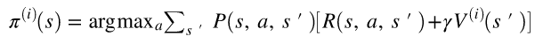

# 江愷笙 <span style="color:red">(106062568)</span>

# Homework1 report

TA: try to elaborate the algorithms that you implemented and any details worth mentioned.

## Overview
This homework is related to UC Berkerly cs294 MDPs.

> Markov Decision Process is a discrete time stochastic control process. At each time step, the process is in some state s, and the decision maker may choose any action a that is available in state s. The process responds at the next time step by randomly moving into a new state s', and giving the decision maker a corresponding reward R(s,a,s')
## Implementation
In this homework we have to implement value iteration, policy iteration and tabular Q-learning. In value and policy iteration, we use a grid world which simulate a frozen lake with goal and hole on it. For an action on a specific state, mdp.P[state][action] will return all possible next state and the probability and reward accordingly.
* Value Iteration

For value iteration, we have to implement two math equation below.

<table border=1>
<tr>
<td>


</td>
</tr>
</table>
To update the value function for a given state, we have to go through each action in the state. And for each action, we have to sum over all the possible next state and finally, figure out the max value of the actions and update it to the value function in this state, and update the index of the action to the policy of the state.

```python
V = np.zeros(mdp.nS)
pi = np.zeros(mdp.nS)
for s in range(mdp.nS):
    V_act = np.zeros(mdp.nA)
    for a in range(mdp.nA):
        for prob, s_, reward in (mdp.P[s][a]):
            V_act[a] = V_act[a] + prob * (reward + gamma * Vprev[s_])	# sum over all the possible next state
    V[s] = np.amax(V_act)						# update the max value of the action to the value function
    pi[s] = np.argmax(V_act)						# update the index of this action to the policy
```

* Policy Iteration

For policy iteration we have to compute state value function first and then the state action value function, finally, combine them to complete the policy iteration. 
<table border=2>
<tr>
<td>


</td>
</tr>
</table>
We use the matrix form to solve the linear equation to obtain state value function. (I - gamma * P)V = P * R, which is equal to the matrix form Ax = B.

```python
a = np.zeros((mdp.nS, mdp.nS)) 
b = np.zeros(mdp.nS)
I = np.identity(mdp.nS)				# generate an identity matrix
P = np.zeros((mdp.nS, mdp.nS))
for s in range(mdp.nS):
    for prob, s_, reward in mdp.P[s][pi[s]]:	# for a given policy in the state
        P[s][s_] += prob
        b[s] += prob * reward			# here we cannot use another array R to sum over all the reward
a = I - (gamma * P)				# and then do the matrix multiplication P*R
V = np.linalg.solve(a, b)			# since each reward has its corresponding probability
```

State action value function is a 2D array which records the value for each state and each action accordingly.

```python
Qpi = np.zeros([mdp.nS, mdp.nA])
for s in range(mdp.nS):
    for a in range(mdp.nA):
        for prob, s_, reward in mdp.P[s][a]:
            Qpi[s][a] += prob * (reward + gamma * vpi[s_])
```

Finally we combine the two function to do the policy iteration.

```python
for it in range(nIt):
    vpi = compute_vpi(pi_prev, mdp, gamma)
    qpi = compute_qpi(vpi, mdp, gamma)
    pi = np.argmax(qpi,1)	# the policy is the index of the max value for each state 
    				# (i.e. the action with the max value)
```

## Installation
* Anaconda
* Ipython notebook
* Python3.5
* OpenAI gym
## Results


