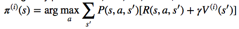

# Homework1 report


# 劉臨軒 <span style="color:red">(106062515)</span>

## Implementation
1. Problem 1: implement value iteration:
  * in the iteration for loop
  * 
  * 

```
        V = np.zeros(mdp.nS)
        pi = np.zeros(mdp.nS)
        for s in range(mdp.nS):
            rewardSumMax = -1
            action = 0
            for a in range(mdp.nA):
                rewardSum = 0
                for ps in range (len(mdp.P[s][a])): # all probabilities
                    probability = mdp.P[s][a][ps][0]
                    nextState = mdp.P[s][a][ps][1]
                    reward = mdp.P[s][a][ps][2]
                    rewardSum = rewardSum + probability * (reward + gamma * Vprev[nextState])

                if rewardSum > rewardSumMax:
                    rewardSumMax = rewardSum
                    action = a
                    
            V[s] = rewardSumMax
            pi[s] = action
```
  
2. Problem 2a: state value function:
  * compute state-value function
  * 
```
    I = np.identity(mdp.nS)
    a = np.zeros((mdp.nS, mdp.nS))
    b = np.zeros(mdp.nS)
    
    for s in range(mdp.nS):
        action = pi[s]
        for ps in range(len(mdp.P[s][action])):
            probability = mdp.P[s][action][ps][0]
            nextState = mdp.P[s][action][ps][1]
            reward = mdp.P[s][action][ps][2]
            
            a[s][nextState] = a[s][nextState] + probability
            b[s] = b[s] + probability * reward
            
    a = I - gamma*a
    V = np.linalg.solve(a, b)
```

3. Problem 2b: state-action value function
  * compute state-action value function
  * 
```
    Qpi = np.zeros([mdp.nS, mdp.nA]) # REPLACE THIS LINE WITH YOUR CODE
    for s in range(mdp.nS):
        for a in range(mdp.nA):      
            for ps in range(len(mdp.P[s][a])):
                probability = mdp.P[s][a][ps][0]
                nextState = mdp.P[s][a][ps][1]
                reward = mdp.P[s][a][ps][2]

                Qpi[s][a] = Qpi[s][a] + probability*(reward+gamma*vpi[nextState])
```

4. Problem 3: Sampling-based Tabular Q-Learning
  * random action with probability of eps
```
    r = random.random()
    if r < eps:
        action = random.randint(0,3)
    else:
        action = np.argmax(q_vals[state])
```

  * Q learning update
  * 
```
    target = reward + gamma*np.max(q_vals[next_state]) #10
    q_vals[cur_state][action] = (1-alpha)*q_vals[cur_state][action] + alpha*target
```
  * start learning
```
    action = eps_greedy(q_vals, eps, cur_state)
    next_state, reward, done, info = env.step(action)
    q_learning_update(gamma, alpha, q_vals, cur_state, action, next_state, reward)
    cur_state = next_state
```


