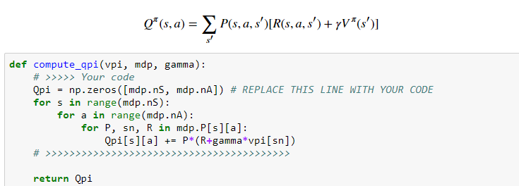
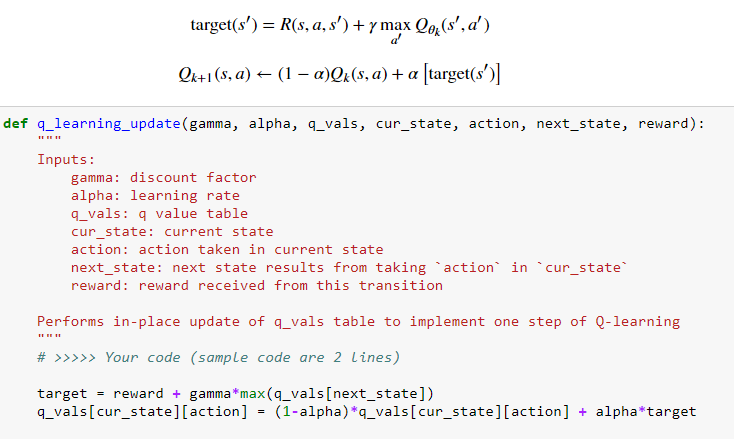

# Homework1 report

TA: try to elaborate the algorithms that you implemented and any details worth mentioned.
## Problem 1: implement value iteration

First, I'm required to implement value iteration(value update, Bellman update/back-up) which was mentioned in the class. 

Here's my implementation

## Problem 2: Policy Iteration
### Problem 2a: state value function

Here, we're going to the exact value function. First find a(idendity matrix - gamma*P) and b(sum of P*R), then use numpy.linalg.solve to find the value function V

### Problem 2b: state-action value function

Since we have the state value function, then we can calculate state-action value function which is denoted as Qpi

## Problem 3: Sampling-based Tabular Q-Learning

If the environment is given as a blackbox physics simulator, then we won't be able to read off the whole transition model.So in this problem we're going to solve using sampling-based tabular Q-learning.

First, we randomly explore(select actions) the environmen5t or take some action based on existing experiences(greedy)

Then implement the Q-balue update function

Finally, we can combine them together to complete the agent. For each iteration, we make action, get the reward from environment, update Q-function, update current state, ... next iteration

