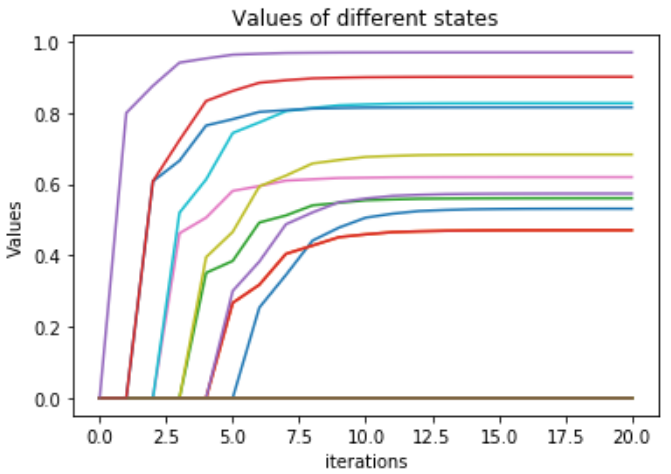

# 王智寬 (106062601)

# Homework2 / MDPs

## Overview
In homework2, we solve Markov Decision Processes(MDPs) with finte state and action space via value iteration, policy iteration, and tabular Q-learning. 

In first and second part, we use the <code>FrozenLakeEnv()</code> environment, a simple gridworld MDP that is taken from gym library, to implement value iteration and policy iteration. 

In the last part, we utilize <code>CrawlingRobotEnv()</code> , a crawler robot which is also taken from gy,, to implement tabular Q-learning.

## Part 1 : implement value iteration

### Algorithm

### Code

<code>value_iteration() </code> implements the value iteration. Here are some highlights in each iteration :

Initalize an iteration by

<code>

    Vprev = Vs[-1] # V^{(it)}
    V = np.zeros(nS)
    pi = np.zeros(nS)

</code>

I use 3 for-loops to calculate value and get optimal pi:

  first loop: find all states s0~s15's Value and action

  second loop: find a state's best value and action

  third loop : find all possible move in a direction

Then I use <code>np.amax()</code> to get Value, <code>np.argmax()</code> to get pi

<code>

    for state in range(nS):                  
        V_dir = np.zeros(4)        
        for direct in range(4):                    
            for possible_dir in range(len(mdp.P[state][direct])):            
                reward = gamma*Vprev[mdp.P[state][direct][possible_dir][1]]                
                V_dir[direct] = V_dir[direct] + mdp.P[state][direct][possible_dir][0]* (mdp.P[state][direct][possible_dir][2] + reward   
        V[state]=np.amax(V_dir)
        pi[state]=np.argmax(V_dir)

</code>

### Results

## Part 2 : 

### Algorithm

### Code

#### Step1 : Implement <code>compute_vpi()</code> to compute the state-value function  Vπn

<code>
  
    nS = mdp.nS  
    a = np.eye(nS) 
    b = np.zeros(nS)
    V = np.zeros(nS) # REPLACE THIS LINE WITH YOUR CODE
    for state in range(nS):
        pii = pi[state]
        for possible_dir in range(len(mdp.P[state][pii])):
            p_ = mdp.P[state][pii][possible_dir][0]
            s_ = mdp.P[state][pii][possible_dir][1]
            r_ = mdp.P[state][pii][possible_dir][2]
            b[state] = b[state] + p_ * r_        
            a[state][s_] = a[state][s_] - gamma*p_            
    V = np.linalg.solve(a, b)
    return V

</code>

#### Step2 : Implement <code>compute_qpi()</code> to compute the state-action value function  Qπ

<code>
  
    def compute_qpi(vpi, mdp, gamma):
      nS = mdp.nS
      nA = mdp.nA
      Qpi = np.zeros([nS, nA])
      for state in range(nS):        
          for action in range(nA):            
              for possible_dir in range(len(mdp.P[state][action])):
                  p_ = mdp.P[state][action][possible_dir][0]
                  s_ = mdp.P[state][action][possible_dir][1]
                  r_ = mdp.P[state][action][possible_dir][2]
                  Qpi[state][action] = Qpi[state][action] + p_*(r_ + gamma*vpi[s_])
      return Qpi
  
</code>

#### Step3 : Run the poolicy iteration

In each iteration, use <code>compute_vpi</code> to calculate the new value function <code>vpi</code> with previous pi <code>pi_prev</code>

Then use <code>compute_qpi</code> and new <code>vpi</code> to compute the <code>Qpi</code> matrix 

Finally, we can aquire new pi from <code>Qpi</code>

<code>

    vpi = compute_vpi(pi_prev, mdp, gamma)
    Qpi = compute_qpi(vpi, mdp, gamma)
    pi = np.argmax(Qpi, axis=1)    

</code>

### Results

## Part 3 :

### Algorithm

### Code

### Results

